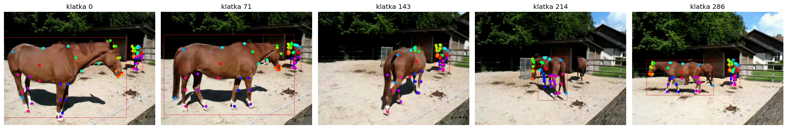

# horse-pain-poc

> Automated RHpE scoring with V-JEPA-2 — methodology-first PoC

[](docs/lessons_learned.md)
[](docs/lessons_learned.md)
[](LICENSE)
[](pyproject.toml)

The Ridden Horse Pain Ethogram (Dyson 2018) is a 24-behavior checklist for detecting musculoskeletal pain in ridden horses. This repo explores whether a **frozen video foundation model** (V-JEPA-2, Meta 2025) plus **session-aware evaluation** (LOSO) can replicate the published Read My Ears baseline (Alves CVPR W'25, AUC 0.875) and generalize to wilder field data.

> **Scope note.** This is *single-behavior classification*, not pain detection. RHpE requires ≥8 of 24 behaviors co-occurring before pain inference is appropriate (Dyson 2018). The current MVP focuses on one behavior (ear movement); the methodology is built so the same V-JEPA-2 + linear-probe pipeline can be re-applied per behavior. Multi-behavior pain assessment is a 2+ year horizon and requires clinical validation with certified RHpE assessors.


*5 frames from `00_smoke_dlc_sample.ipynb` — DLC SuperAnimal-Quadruped zero-shot on [Horse_walking_in_corral_MVI_7490](https://commons.wikimedia.org/wiki/File:Horse_walking_in_corral_MVI_7490.MOV.ogv) (Wikimedia Commons CC).*

This is a research prototype, **not a diagnostic tool**.

## Status (as of 2026-05)

| Behavior | Approach | LOSO AUC | Status |
| --- | --- | --- | --- |
| ear_movement (Read My Ears replication) | V-JEPA-2 + linear probe | **0.875** | ✓ replicates paper claim under source-aware split |
| head_position | V-JEPA-2 full-frame + LR | 0.561 | ✗ session leakage (LOO 0.898 → LOSO 0.561, Δ −34pp) |
| eye_expression | V-JEPA-2 + LR | n/a | ✗ all positive sessions from one source — confound, dropped |
| ear_position (anchor data) | V-JEPA-2 full-frame + LR | <0.5 | ✗ requires ear-region ROI crop, not full-frame |

**Current focus.** Track B — `ear_position` via Read My Ears-style ROI replication on a diverse field dataset. Target: LOSO AUC ≥ 0.70 across ≥ 8 of ≥ 10 sources, with 0.80 strong, 0.85 stretch (see [Lesson 11](docs/lessons_learned.md)). The 53-clip DIY anchor dataset is **not** training data — iteration 6.5 LOSO disproved any per-behavior claim built on it.

## Key methodological findings

- **Read My Ears 0.875 holds under source-aware LOSO** (Sanity 5). Replication confirms the paper claim; the random clip-level split happened not to inflate due to visual heterogeneity of their 12 sources. Earlier suspicion that 0.875 was inflated has been falsified empirically.
- **LOO/LOSO gap ~10pp on this dataset.** Any future ear-related LOO result should be mentally adjusted by ~10pp to estimate the LOSO baseline. On the 53-clip DIY data the gap is up to 34pp — small-N + multi-source makes LOO fundamentally unsafe.
- **Conditional bg-masking** ([Lesson 9](docs/lessons_learned.md)). Secondary motion in frame (a second horse, a walking handler) degrades V-JEPA-2 cross-source robustness. YOLO-detected scene motion → switch to bg-masked features (S8 fold: 0.633 → 0.875, **+24pp**); clean scene → unmasked (S12: 1.000 → 0.661 if forced through masking, **−34pp**). Conditional preprocessing, not a global default.
- **DINOv2 alone fails cross-source.** Image-only mean-pooled DINOv2 LOO 0.780 → LOSO 0.514 (chance), with anti-correlation on 4 of 12 sources. Temporal context (V-JEPA-2) is necessary, not nice-to-have.
- **V-JEPA-2 SSv2 fine-tune ≡ pretrain-only checkpoint at the encoder** ([Lesson 12](docs/lessons_learned.md)). All 587 encoder layers are byte-identical between `vjepa2-vitl-fpc16-256-ssv2` and `vjepa2-vitl-fpc64-256` — the SSv2 head is dropped when loading via `VJEPA2Model`. Comparisons of "SSv2 vs PT" in our pipeline measure the same encoder.

## What works

- **V-JEPA-2 ViT-L encoder features** (1024-d, pretrain-only by construction in our pipeline)
- **Read My Ears protocol** (face mask + ear bbox crop + linear probe) — LOO 0.97, bg-masked LOO 0.91, **LOSO 0.875** (source-invariant on their data)
- **Linear probe + LOO observed AUC + permutation test + LOSO** as a four-layer evaluation stack
- **Hard pre-committed decision thresholds** for architecture choices (4-level rule before running comparison)
- **Static-frame collapse diagnostic** for distinguishing temporal vs static feature reliance
- **Conditional background masking** — apply when YOLO detects > 1 subject in frame, skip otherwise

## What doesn't work

- **5-class softmax on 53 anchor clips** — too small, session-confounded; eye_expression sink-effect
- **head_position 0.898 LOO** as MVP candidate — Sanity 3 LOSO 0.561 = session leakage
- **DINOv2 + V-JEPA-2 concat** — lost on 2 of 4 behaviors in the iter-6 matrix; LOSO 0.747 vs SSv2 0.875 in Sanity 5
- **DINOv2 alone as universal backbone** — LOSO 0.514 on Read My Ears, anti-correlated on 4 of 12 sources
- **Background masking as a global default** — hurts strong sources by ~10pp while helping weak ones; must be conditional
- **The 53-clip DIY anchor dataset as a training set** for any per-behavior classifier (iter 6.5)

Full methodology trail in [`docs/lessons_learned.md`](docs/lessons_learned.md) — 12 lessons across iter 1–6.5, including why LOO is not a safe baseline in this domain and why sample size has to be counted in sessions, not clips.

## How to engage

**For ML researchers / academics.** The substantive contributions live in [`docs/lessons_learned.md`](docs/lessons_learned.md): conditional bg-masking with quantified per-source costs (Lesson 9), the two failure modes in cross-source ear movement detection (Lesson 10, including the S8 two-horses confound case study), and the LOSO replication of Read My Ears 0.875 (Lesson 1; raw `outputs/iter65_sanity5_*.json` files are produced locally by `setup.sh` + the notebooks, not committed). Methodology critique welcome via Issues.

**For data contributors.** Field dataset collection is in progress, targeting ≥ 10 horses × 2–3 ear states × 2–3 takes = 60–100 clips across ≥ 10 unique sessions. Read [`docs/recording-protocol.md`](docs/recording-protocol.md) before recording (one page, ~5 min). Welfare > PoC — no provocations, no induced stress, naturalistic training-session footage only. GDPR-compliant consent template included (English + Polish).

**For replication.** [`GATE.md`](GATE.md) documents the original Phase 0 GO/NO-GO criteria (all passed). Quickstart below — `setup.sh` is idempotent, runs on macOS Apple Silicon or Colab T4 fallback, 6 notebooks staged 00 → 99.

## Quickstart (macOS Apple Silicon, local)

```bash
git clone https://github.com/piotrpawluk/horse-pain-poc
cd horse-pain-poc
bash setup.sh
source .venv/bin/activate
jupyter lab notebooks/00_smoke_dlc_sample.ipynb
```

Notebook order: `00` (DLC sanity) → `01` (Read My Ears replication) → `02` (V-JEPA-2 zero-shot) → `04` (few-shot 5-behavior validation; the iter-6.5 caveats above apply). Full results in [`GATE.md`](GATE.md), full methodology in [`docs/lessons_learned.md`](docs/lessons_learned.md).

## Quickstart (Google Colab, fallback)

Open `notebooks/99_colab_fallback.ipynb` in [Google Colab](https://colab.research.google.com/) (File → Upload notebook). Free T4 is sufficient. No local setup required.

## Repo structure

```
.
├── setup.sh                  idempotent installer (uv-based; macOS / Linux)
├── pyproject.toml            pinned deps (DLC 3.0.0rc14, torch 2.11, transformers 5.7, gradio, webvtt-py)
├── GATE.md                   Phase 0 GO/NO-GO criteria + lessons (historical)
├── docs/
│   ├── lessons_learned.md    12 methodological lessons from iter 1-6.5 (must-read)
│   └── recording-protocol.md field data collection protocol (welfare-first, GDPR template)
├── notebooks/
│   ├── 00_smoke_dlc_sample.ipynb            DLC SuperAnimal-Quadruped zero-shot
│   ├── 01_read_my_ears_replicate.ipynb      Read My Ears (CVPR W'25) replication
│   ├── 02_vjepa2_zeroshot.ipynb             V-JEPA-2 + linear probe baseline
│   ├── 03_xclip_zeroshot.ipynb              X-CLIP text-conditioned (negative result)
│   ├── 04_few_shot_rhpe_validation.ipynb    5-behavior few-shot validation (iter 6.5 caveats apply)
│   └── 99_colab_fallback.ipynb              Google Colab T4 backup
├── tools/
│   └── subtitle_search.py                   VTT keyword parser (anchor clipping helper)
└── .gitignore
```

`data/`, `checkpoints/`, `outputs/`, `vendor/` are gitignored — `setup.sh` fetches them (sample horse video from Wikimedia Commons CC, weights from HuggingFace).

## Setup gotchas (for replication)

1. **DLC 3.0** stable not yet released (May 2026); pin `>=3.0.0rc14` with `--prerelease=allow`
2. **matplotlib pin `<3.9`** (DLC requirement)
3. **HF Hub 1.x** removed `huggingface_hub.commands.huggingface_cli` — use the Python API `snapshot_download`
4. **HEVC in iPhone .MOV clips** — OpenCV reads them natively; macOS TCC quarantine xattrs block some files imported from Photos library (`xattr -d com.apple.quarantine <file>` after import)
5. **Inference cost**: V-JEPA-2 ViT-L 16 frames @ 256×256 ≈ 1.3 s/clip on MPS; 283 clips ≈ 6 min

## Methodology stack rationale

- **V-JEPA-2 ViT-L** ([Meta, June 2025](https://arxiv.org/abs/2506.09985)) — foundation video model, 1024-d encoder features. Used as pretrain-only backbone (the SSv2 fine-tune does not modify encoder weights — see [Lesson 12](docs/lessons_learned.md)).
- **DINOv2 large** (image-only, 1024-d) — alternative image-only baseline; in our pipeline ~10pp behind V-JEPA-2 on ear movement and anti-correlated cross-source on 4 of 12 sources.
- **DeepLabCut SuperAnimal-Quadruped** ([Nature Comm 2024](https://www.nature.com/articles/s41467-024-48792-2)) — zero-shot pose estimation for 45+ species; staged for Track C (temporal behaviors, deferred to Phase 3).
- **Read My Ears** (Alves et al., [CVPR W'25](https://arxiv.org/abs/2505.03554)) — baseline ROI pipeline: face mask + ear bbox + classifier; the per-behavior ROI pattern generalizes to other RHpE behaviors.
- **scikit-learn RidgeClassifier / LogisticRegression** — linear probe on cached embeddings, seconds to train on CPU.
- **uv** instead of conda — ~10× faster installer, deterministic resolution.

## Ethics / disclaimer

This is a **research prototype, not a diagnostic tool**. Any clinical application requires validation by a certified RHpE assessor and veterinary consultation. Animal welfare is **not negotiable** — if a horse shows pain signals during data collection, the session stops and the horse goes to a vet. No induced stress, no provocations: data must come from naturalistic training sessions only. The recording protocol enforces this categorically.

## License

MIT — see [LICENSE](LICENSE).

## Acknowledgments

- **Mathis Lab** — DeepLabCut + SuperAnimal-Quadruped
- **Alves, Andersen, Zamansky et al.** — Read My Ears (CVPR W'25)
- **Sue Dyson** — RHpE as a clinical framework
- **Wikimedia Commons** — sample horse video under CC license

## Citation

If you cite this repo informally:

> Pawluk, P. (2026). *horse-pain-poc: Automated RHpE scoring with V-JEPA-2 — methodology-first PoC*. GitHub. https://github.com/piotrpawluk/horse-pain-poc

Contact: piotr.pawluk@gmail.com or open an Issue.
