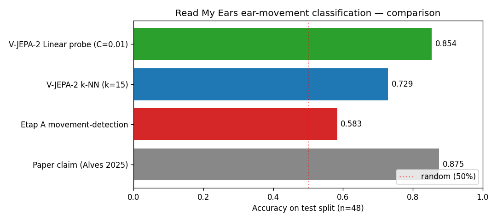

# horse-pain-poc

[](GATE.md)
[](GATE.md)
[](LICENSE)
[](pyproject.toml)

PoC stosu open-source dla automatycznej detekcji bólu u koni
zgodnie z **Ridden Horse Pain Ethogram (RHpE, Sue Dyson, 24 zachowania)**.


*5 klatek z notebooka `00_smoke_dlc_sample.ipynb` — DLC SuperAnimal-Quadruped zero-shot na [Horse_walking_in_corral_MVI_7490](https://commons.wikimedia.org/wiki/File:Horse_walking_in_corral_MVI_7490.MOV.ogv) (Wikimedia Commons CC).*

To **nie jest narzędzie diagnostyczne**. To weekend exploration:
- **Faza 0** (~45 min, [GATE.md](GATE.md)): sanity-check zerolot pose-estimation z DLC
- **Faza 1 Etap A** (~30 min): pełna replikacja Read My Ears (Alves CVPR W'25) movement-detection na ich [HF dataset](https://huggingface.co/datasets/joaomalves/read-my-ears)

## Replication results — Read My Ears ear-movement classification

Pełen pipeline na 48 klipach test split (HF dataset `joaomalves/read-my-ears`):

| Approach | Accuracy | Notes |
|----------|----------|-------|
| **V-JEPA-2 + linear probe** (zero-shot) | **0.854** | Foundation video model z półki, BEZ ich custom YOLO/preprocessing, BEZ żadnego treningu modelu |
| V-JEPA-2 + k-NN (k=15) | 0.729 | Same embeddingi, prostszy klasyfikator |
| Etap A movement-detection (1:1) | 0.583 | Pełna replikacja ich pipeline'u (YOLOv8l + optical flow) |
| Paper claim (Alves CVPR W'25) | 0.875 | Z ich custom YOLOv8n + face_masked_clips + FPS=25 |



**Kluczowe wnioski:**

1. **V-JEPA-2 zerolot jest tylko 2 pp od paper claim** — `facebook/vjepa2-vitl-fpc16-256-ssv2` (Meta, czerwiec 2025) jako ekstraktor cech 1024-D + sklearn `LogisticRegression` na features. Trening klasyfikatora < 1s na CPU. Embedding extraction 283 klipów ~25 min na MPS.
2. **Movement-detection 1:1 (Etap A) nie reprodukuje paper'u** — algorytm hyper-aware na threshold + brak ich preprocessing artifactów (yolov8n, face_masked_clips, FPS=25).
3. **Strategiczna implikacja**: foundation models z półki bywają lepsze niż custom-trained pipelines z paper'ów — szczególnie gdy paper preprocessing nie jest pełnie reprodukowalny. Dla rozszerzenia do 24 RHpE behaviors: V-JEPA-2 embeddings + 24 niezależne linear probes zamiast trenowania custom modelu per-class.

**Co dalej (do dyskusji w Issue #1):**
- Email do autorów Alves/Andersen z konkretnym wynikiem 0.854 jako otwierający kolaborację
- X-CLIP text-conditioned zerolot na 24 RHpE behaviors — czy można w pełni zerowy trening?

## Co znajdziesz w tym repo

```
.
├── setup.sh                  idempotentny installer oparty o uv (macOS / Linux)
├── pyproject.toml            pinowane deps (DLC 3.0.0rc14, torch 2.11, transformers 5.7)
├── GATE.md                   4 binarne kryteria GO/NO-GO + lekcje
├── notebooks/
│   ├── 00_smoke_dlc_sample.ipynb       DLC SuperAnimal-Quadruped zero-shot
│   ├── 01_read_my_ears_replicate.ipynb Read My Ears (CVPR W'25) replikacja + DLC ear proxy
│   └── 99_colab_fallback.ipynb         backup do Google Colab T4
└── .gitignore
```

`data/`, `checkpoints/`, `outputs/`, `vendor/` są gitignored — pobiera je
`setup.sh` (sample horse video z Wikimedia Commons CC, weights z HuggingFace).

## Quickstart (macOS Apple Silicon, lokalnie)

```bash
git clone https://github.com/<your-fork>/horse-pain-poc
cd horse-pain-poc
bash setup.sh
source .venv/bin/activate
jupyter lab notebooks/00_smoke_dlc_sample.ipynb
```

Po uruchomieniu wszystkich komórek notebooków `00` i `01` wypełnij
[`GATE.md`](GATE.md) — 4 binarne kryteria. **3/4 = GO** dla rozszerzenia
do większego projektu, **<3/4 = NO-GO**.

## Quickstart (Google Colab, fallback)

Otwórz `notebooks/99_colab_fallback.ipynb` w
[Google Colab](https://colab.research.google.com/) (File → Upload notebook).
Free T4 wystarczy. Nie wymaga lokalnego setupu.

## Wynik referencyjny

Dla sample [Horse_walking_in_corral_MVI_7490](https://commons.wikimedia.org/wiki/File:Horse_walking_in_corral_MVI_7490.MOV.ogv)
(Wikimedia Commons, 9.6s, 287 klatek, 2 konie):

- **DLC SuperAnimal-Quadruped** wykrył oba konie i nałożył pełen szkielet
  na ≥90% klatek (głowa, kark, łopatki, biodra, kończyny, uszy)
- **DLC ear keypoints proxy** (rolling std pozycji `*_earbase`/`*_earend`)
  wygenerował sensowny timeline ruchu uszu
- **Read My Ears 1:1** padł na `ModuleNotFoundError: ultralytics` —
  wymaga rozszerzenia deps + custom weights (TODO Faza 1)

Czas: ~45 min. Koszt: 0 PLN.

## Lekcje (z `GATE.md`, dla replikacji)

1. **DLC 3.0** stable nie wydane (maj 2026); pinować `>=3.0.0rc14` z
   `--prerelease=allow`
2. **matplotlib pin `<3.9`** (DLC requirement)
3. **HF Hub 1.x** usunął `huggingface_hub.commands.huggingface_cli` —
   używać Python API `snapshot_download`
4. **Sample video URL** — weryfikować przez Wikimedia API:
   `curl 'https://commons.wikimedia.org/w/api.php?action=query&titles=File:NAME&prop=imageinfo&iiprop=url&format=json'`
5. **Inferencja**: 287 klatek 640×480 → ~5 min na M-series CPU/MPS;
   30s 1080p (Faza 2 / 30-50 klipów) liczyć ~10-15 min/klip → wówczas
   warto rozważyć RunPod RTX4090 (~$0.34/h)

## Stack rationale (skrót)

- **DeepLabCut SuperAnimal-Quadruped** — zero-shot pose dla 45+ gatunków
  ([Nature Comm 2024](https://www.nature.com/articles/s41467-024-48792-2)),
  out-of-the-box dla koni, autorzy publikują demo na Colab
- **Read My Ears** (Alves et al., [CVPR W'25](https://arxiv.org/abs/2505.03554))
  — ear movement detection 87,5% accuracy
- **uv** zamiast conda — 10× szybszy, prostszy pojedynczy tool
- **planowany backbone** (Faza 1+): VideoMAE-v2 lub V-JEPA-2 fine-tune
  (foundation models post-2024 obsoletują pre-foundation Broomé 2019)
- **AutoML cloud (Vertex/Azure/AWS)** odrzucony jako strategic dead-end:
  Vertex AutoML to legacy (Google przesuwa na Gemini fine-tuning),
  Azure Custom Vision retires 09.2028, AWS Rekognition Custom Labels
  nie ma natywnego video

## Etyka / disclaimer

To jest **research prototype, nie narzędzie diagnostyczne**. Każde
zastosowanie kliniczne wymaga walidacji przez certyfikowanego RHpE
assessor'a i konsultacji weterynaryjnej. Welfare zwierzęcia jest
nadrzędne wobec PoC — jeśli model wykryje sygnały bólu w trakcie
zbierania danych, należy przerwać sesję i skierować konia do weterynarza.

## Licencja

MIT — zobacz [LICENSE](LICENSE).

## Krótkie podziękowania

- Mathis Lab — DeepLabCut + SuperAnimal-Quadruped
- Alves, Andersen, Zamansky et al. — Read My Ears
- Sue Dyson — RHpE jako framework
- Wikimedia Commons — sample horse video pod licencją CC
